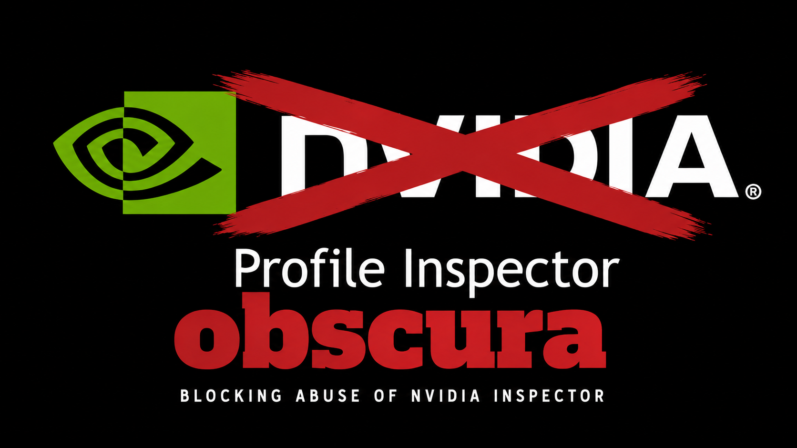
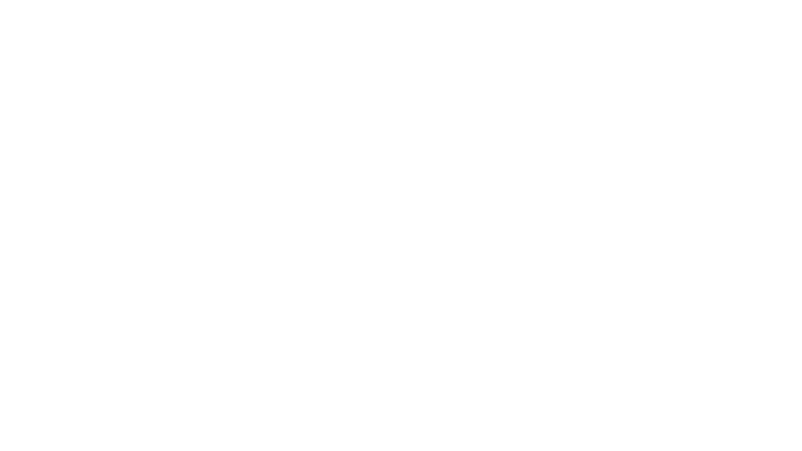
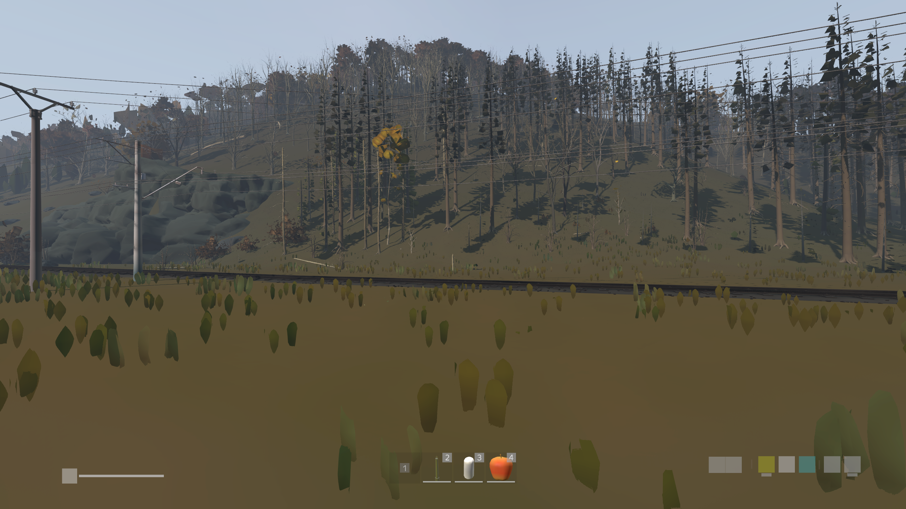

# obscura

DayZ anti-cheat mod that blocks NVIDIA Inspector LOD-bias abuse.

**License:** [CC BY-NC 4.0](LICENSE.txt)



---

**Complementary mod:** [captcha](https://github.com/adelasia/captcha) - captcha that blocks bots and LOD-bias abuse at connect.

---

### False positives

**At default settings, there should not be any false positives on any resolution.**

A white screen only appears if Texture LOD Bias is raised.

The mod's visible mip is set to **3** (mips 0–2 are invisible, 3+ are white).

`x = log₂( max(2048 / width, 2048 / height) )`

At default settings, **x stays below 3 on all common resolutions**, no false positives.

**Either way, triggering means abnormal texture LOD is active.**

---

## How it works

- A fullscreen overlay is always active on the client while the mod is loaded.
- At normal LOD bias the overlay is invisible.
- At higher LOD bias the overlay becomes a solid white screen, making tampering obvious and unplayable.

`LOD sensitivity varies by resolution; lower res needs less LOD bias, higher res needs more.`

<table>
  <tr>
    <td width="50%"></td>
    <td width="50%"></td>
  </tr>
  <tr>
    <td align="center"><b>Normal LOD bias (±0)</b></td>
    <td align="center"><b>Higher LOD bias (around +1.5 or higher)</b></td>
  </tr>
</table>

---

## Why do I need this?

This mod prevents players from using NVIDIA Inspector LOD bias to gain an unfair advantage.

<table>
  <tr>
    <td width="33%"></td>
    <td width="33%"></td>
    <td width="33%"></td>
  </tr>
  <tr>
    <td align="center"><b>Normal LOD bias (±0)</b></td>
    <td align="center"><b>High LOD bias (+3)</b></td>
    <td align="center"><b>Higher LOD bias (+12)</b></td>
  </tr>
</table>

---

## Install

This repo is source only - grab the built mod from Steam Workshop, or build it
yourself from this source using DayZ Tools (AddonBuilder).

### Server

1. Add `@obscura` to your server mod list (Workshop) or your own built `@obscura` folder.
2. Place `obscura.bikey` into the server `keys/` folder.
3. Set `verifySignatures = 2` in `serverDZ.cfg`.

### Client

1. Subscribe on Steam Workshop **or** build `@obscura` yourself from this source.
2. Enable `@obscura` in the launcher / DZSA mod list.

A built client folder must include:

```
@obscura/
  addons/obscura.pbo
  addons/obscura.pbo.obscura.bisign
  keys/obscura.bikey
  meta.cpp
```

> Note: the signing key was rotated on 2026-07-14 - if you have an older
> `adelasia.bikey` from a previous release, replace it with `obscura.bikey`.

## Feedback

Report bugs by [opening an issue](https://github.com/adelasia/obscura/issues).

For suggestions, questions, or general chat, [start a discussion](https://github.com/adelasia/obscura/discussions).

---

## License

Forks and redistributions must credit adelasia and comply with [CC BY-NC 4.0](LICENSE.txt).
